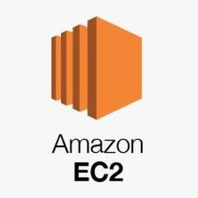

- Máquina virtual em nuvem e de forma elástica, redimensionável, para provisionamento de máquinas.
- Baixo custo, configurações diversas, Windows / Linux, tamanhos variados. Cobrado por hora.

# Tópicos

 ## EBS - Elastic Block Store EBS
    
    Disco da máquina virtual / instância EC2. Pode existir um ou mais ,geralmente utiliza um disco para o sistema operacional, e outro disco para os dados.

    **Tamanho e Tipo de Disco EBS**:
        - **SSD (gp2):** Uso geral. Exemplo: WebServer.
        - **SSD Prov IOPS (io1):** Permite definir taxa de leitura e gravação de disco. Exemplo: Banco de Dados.
        - **Throughput Optimized HDD (st1):** Disco magnético alta taxa de transferência. Exemplo: BigData.
        - **Cold HDD (sc1):** Arquivo. Exemplo: archive.

    **Armazenamento Objeto x Armazenamento em Bloco**
    